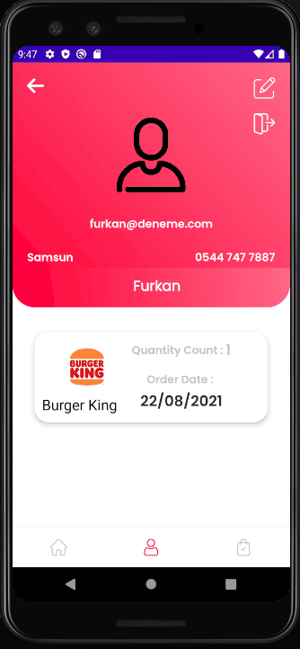

# Yemeksepeti Mobile Android Bootcamp Graduation Project.

## Used Technologies

- MVVM Architecture
- Retrofit, okHttp
- Dagger Hilt
- Kotlin Coroutine
- ViewModel - LiveData
- Gson
- Lottie Animations
- RecyclerView
- Fragments
- Room

## Project Structure

---

- Splash Screen
- Onboarding Screens
- Login Screen
- Home Screen
- Restaurant Detail Screen
- Meal Detail Screen
- Order Card Screen
- Profile Screen
- Update User Screen
- Last Orders Screen
- Add Restaurant Screen
- Add Meal Screen

### Screen Usage

---

<table>
  <tr>
    <td></td>
    <td></td>
    <td></td>
  </tr>
</table>

<table>
  <tr>
    <td></td>
    <td></td>
    <td></td>
  </tr>
</table>
